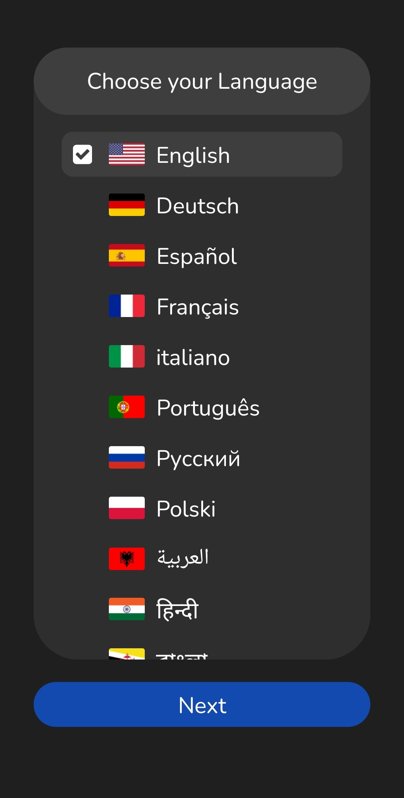

# Money Support - Mobile App

## About Money Support

Money Support is an open-source application designed to **assist you in managing your finances**. It is accessible on **all devices** through the [mobile app](https://github.com/Buldes/Money-Support-Mobile_App) or the [website](https://buldes.github.io/money-support/) (more platforms are coming soon, including program for PC).

The application offers valuable insights into your **income, expenses, and current bank balance**. It's **user-friendly, free of charge, and ensures the security of your data**. There's **no need for registration**, and your information remains stored locally on your device rather than on a server.

You have the flexibility to add new users for youre purposes such as cash, credit cards, and projects. There is no limit to the number of users you can add.

---

I personally recommend using the mobile application for a seamless experience on your smartphone. It's faster than the web application, supports offline usage, and provides more customization options. However the choice is yours.

In this repository, you'll find the mobile app (currently available only for Android). You can also check out the website [here](https://github.com/Buldes/money-support).

## Download Links

- [Download APK V1.0 - Early Acess (latest)](https://expo.dev/artifacts/eas/9DAGoJx3zrTfishi3HTMFJ.apk)

## Supported Languages

Language translations made with ChatGPT

- English
- German
- Spanish
- French
- Italian
- Portuguese
- Russian
- Polish
- Arabic
- Hindi
- Bengali
- Chinese (Mandarin)
- Japanese

## Supported Currencies

- US Dollar: $
- Euro: €
- British Pound: £
- Japanese Yen: ¥
- Chinese Yuan: CN¥
- Canadian Dollar: CA$
- Australian Dollar: AU$
- Indian Rupee: ₹
- Brazilian Real: R$
- Swiss Franc: CHF

## Screenshots

**The Main Menu**

**Settings**

**Easy Setup**

